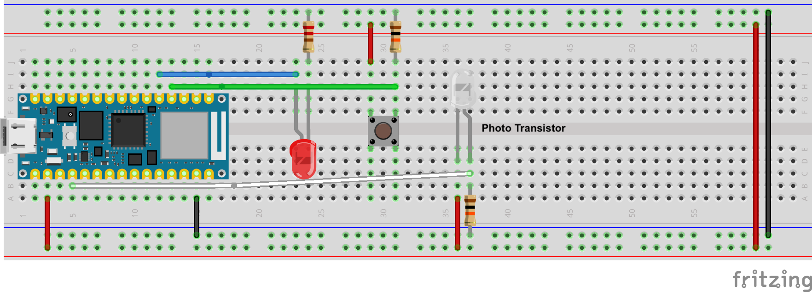

# Circuit Tester

# Build the Circuit

Connect the top button let to 3.3V rail.
Connect the bottom button leg to pin D2 with a 10k ohm pull down resistor to ground rail.
Connect LED long leg to pin D3, short leg to a  220 ohm resistor going to ground rail.
Connect phototransistor long leg to A0 with a 10k ohm resistor going to ground rail.
Connect phototransistor short let to 3.3V rail.

## Test it!
- Upload the code to the Arduino and open the serial monitor
- Press the button
  - Led turns on
  - Light level is printed to the monitor
- Cover up the transistor or shine a bright light on it and press the button
  - Light level reading should change.

Note: 
Expect readings from 0 to 4000. 0 is absolutely no light, 4000 super intense light. If you are getting values in a different range (i.e. between 0 - 300) try flipping the phototransistor.
